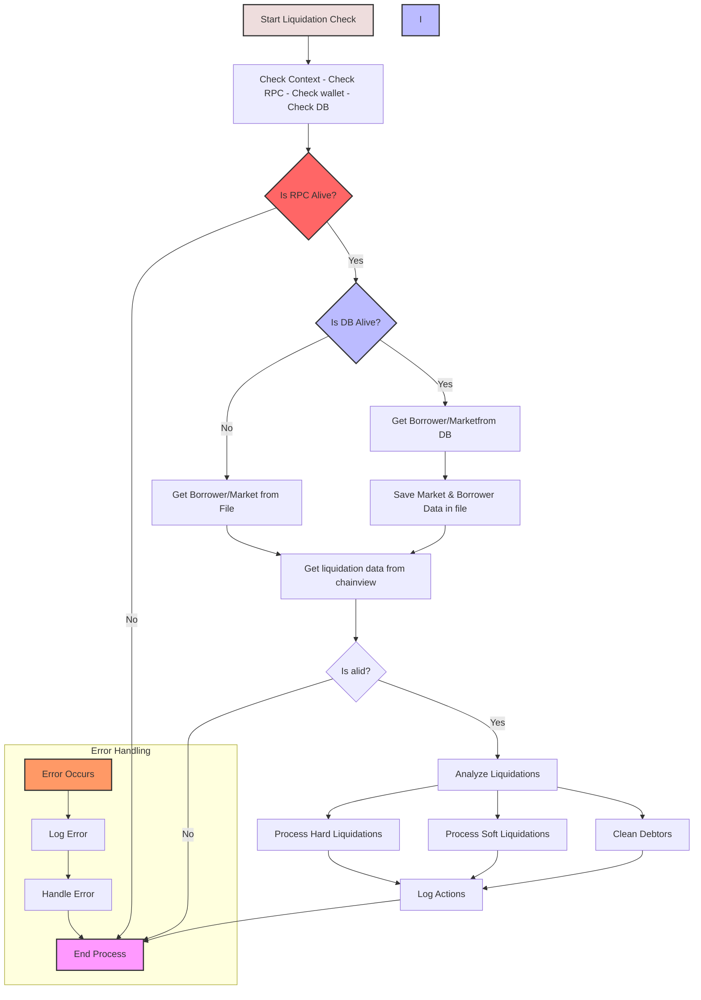

# Tagent Indexer

## About The Project

Here's the project that we use to index onChain data for Convergence protocol. The main aim is to compute and store in a database:

- data that the Blockchain cannot compute.
- data that tooks to much time to be retrieved fully onChain
- historical data for BI

The Indexer is a Typescript project that:

- Iterates indefinetly
- Listens events on all the CVG contracts
- Computes data based on event reception
- Stores events & computed data in a database
- Can be clean and restarded from the beginning ( if we want to update it )
- Restart to the last block indexed if it's stopped

### Built With

- [ethers.js](https://res.cloudinary.com/divzjiip8/image/upload/v1624392472/logos/ethers_blue.png)
- [prisma](https://www.prisma.io/)

<!-- GETTING STARTED -->

## Getting Started

### Installation

1. First install the dependencies of the project.

   ```sh
   $ npm install
   ```

2. Run the indexer :

   ```sh
   $ npm run indexer-block
   ```

<!-- USAGE EXAMPLES -->

## Usage

- Clean the database ( all the table), that will reset the indexing to the LAST_BLOCK_INDEXED from your .env
  ```sh
  $ npm run clean
  ```
- LAST_BLOCK_INDEXED && CONTRACT_CVG_CONTROL_TOWER are used only at the first run of index.ts. After that first execution, they will be registered & updated in the database

## Useful Commands

Generate Prisma TypeScript types

`npx prisma generate`

Push Prisma schema to database

`npx prisma db push`

Pull database to Prisma schema

`npx prisma db pull`

Create database tables from Prisma schema

`npx prisma migrate dev --name init`

## Liquidation Bot

The Liquidation Bot is a critical component that monitors and processes liquidations in the Convergence protocol. It performs the following functions:

1. **Parameter Collection**
   - Validates the execution context
   - Gathers market and borrower data

2. **On-chain Data Analysis**
   - Retrieves real-time on-chain data for markets and borrowers
   - Analyzes positions for potential liquidations

3. **Liquidation Processing**
   - Handles two types of liquidations:
     - Hard Liquidations: For positions that are severely undercollateralized
     - Soft Liquidations: For positions that are slightly undercollateralized
   - Cleans up debtors who are no longer in debt

4. **Logging and Error Handling**
   - Maintains detailed logs of all liquidation actions
   - Tracks errors and execution context
   - Provides audit trail for all liquidation activities

The bot can be run using:

```sh
$ npm run check-liquidation
```

This will execute the liquidation checks and process any necessary liquidations while maintaining comprehensive logs of all actions.

### Execution Flow



## Snapshot Vote ( TODO )

## Seeds

`npm run tangent:feed-tokens`
`npm run tangent:feed-tasks`

Then deploy & context on contracts

`npm run tangent:indexer-block`
`npm run tangent:indexer-points`

..
